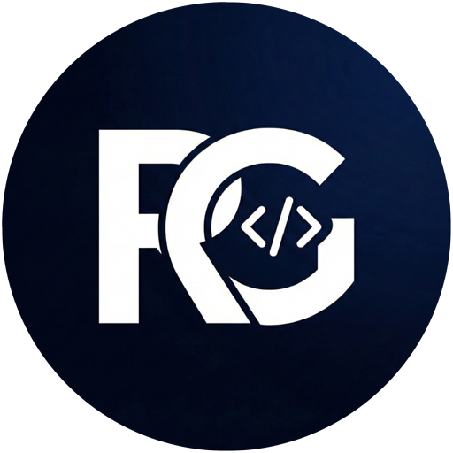

<p align="center">
  
</p>

<h1 align="center">Richard G Studios</h1>

<p align="center">
  <strong>Seu ambiente de trabalho com IA</strong><br/>
  Geração de imagens e vídeos com Gemini · Biblioteca de 12.000+ prompts · Vault pessoal de prompts · Kanban boards
</p>

<p align="center">
  
  
  
  
  
</p>

---

## Módulos

### NanoBanana Studio
Explore mais de **12.000 prompts profissionais** e gere imagens/vídeos com IA usando os modelos Gemini e Imagen diretamente no seu computador.

- **Browse** — Pesquise e filtre prompts por categoria
- **Studio** — Gere imagens com até 8 referências visuais (attachment slots)
- **Brainstorm** — Chat com IA para refinar ideias e prompts
- **Projects** — Agrupe gerações em projetos organizados
- **Gallery** — Visualize todas as suas criações
- **History & Favorites** — Acesse rapidamente gerações anteriores

**Modelos suportados:**

| Modelo | Tipo | Attachments | Resolução |
|--------|------|:-----------:|-----------|
| Flash | Imagem | até 8 | Padrão |
| NB Pro | Imagem | até 8 | Padrão |
| Pro | Imagem | até 8 | até 4K (4096×4096) |
| Imagen 4.0 Ultra | Imagem | — | Padrão |
| Veo 3.1 | Vídeo | 1 | — |
| Veo 3.1 Fast | Vídeo | 1 | — |

### PromptSave
Salve, organize e reutilize seus prompts pessoais — de código, imagem, texto e muito mais.

- Pastas com cores personalizáveis
- Drag & drop para reordenar
- Enhancement com IA (Gemini)

### KanBoard
Organize suas tarefas e projetos com quadros Kanban completos.

- Colunas e cards com drag & drop
- Labels, checklists e datas de vencimento
- Prioridades e progresso visual

---

## Tech Stack

| Camada | Tecnologia |
|--------|------------|
| Framework | Next.js 16 (App Router) |
| UI | React 19, Tailwind CSS 4, Framer Motion |
| Estado | Zustand |
| Banco de dados | SQLite (better-sqlite3, WAL mode, FTS5) |
| IA | Google Gemini API (`@google/genai`) |
| Validação | Zod |
| Drag & Drop | dnd-kit |
| Ícones | Lucide React |
| Fontes | Outfit · Inter · JetBrains Mono |

---

## Primeiros Passos

### Pré-requisitos

- **Node.js** 18+
- **Gemini API Key** — [obtenha aqui](https://aistudio.google.com/apikey)

### Instalação

```bash
# Clone o repositório
git clone https://github.com/richardgms/richardgstudios.git
cd richardgstudios

# Instale as dependências
npm install

# Configure a API key
cp .env.example .env.local
# Edite .env.local e adicione sua GEMINI_API_KEY

# Inicie o servidor de desenvolvimento
npm run dev
```

Abra [http://localhost:3000](http://localhost:3000) para acessar o Hub.

### Scripts

```bash
npm run dev       # Servidor de desenvolvimento
npm run build     # Build de produção
npm run start     # Servir build de produção
npm run lint      # Linting com ESLint
```

---

## Estrutura do Projeto

```
src/
├── app/
│   ├── page.tsx                # Hub (seletor de módulos)
│   ├── (studio)/               # NanoBanana Studio
│   │   ├── browse/             # Explorar prompts
│   │   ├── studio/             # Geração de imagens
│   │   ├── brainstorm/         # Chat com IA
│   │   ├── projects/           # Gerenciamento de projetos
│   │   ├── gallery/            # Galeria de criações
│   │   ├── favorites/          # Favoritos
│   │   ├── history/            # Histórico
│   │   └── trash/              # Lixeira (soft delete)
│   ├── (promptsave)/           # PromptSave
│   │   └── vault/              # Vault de prompts
│   ├── (kanboard)/             # KanBoard
│   │   ├── boards/             # Lista de quadros
│   │   └── board/[id]/         # Quadro individual
│   └── api/                    # API Routes
├── components/                 # Componentes React
├── lib/                        # Utilitários, DB, store
├── hooks/                      # Custom hooks
└── store/                      # Stores adicionais
```

---

## Licença

Projeto privado — todos os direitos reservados.
